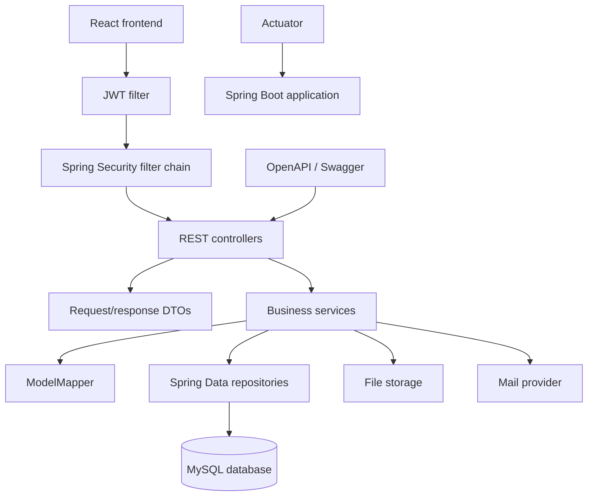
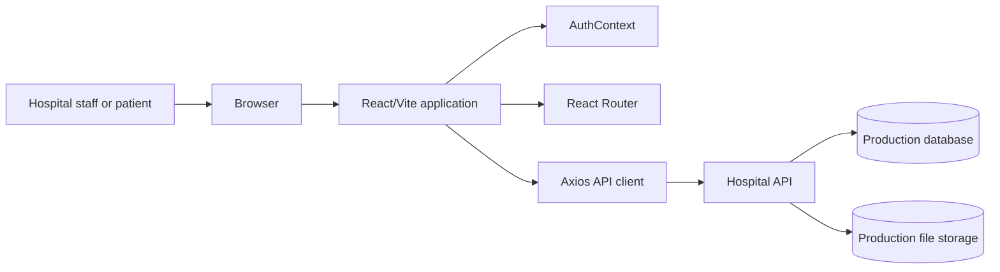
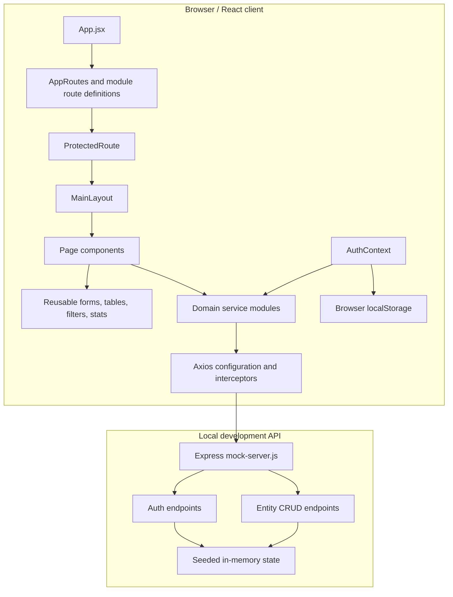
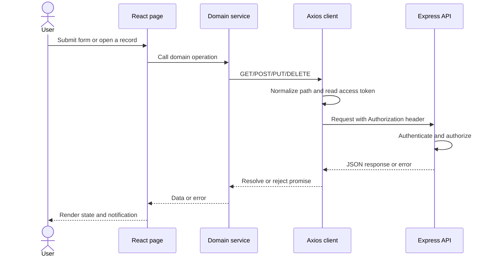

# Medi Vision

Medi Vision is a role-based hospital management system built with React and Vite. It provides a single web application for managing patients, doctors, appointments, admissions, billing, medicines, prescriptions, laboratory reports, ICU records, nurses, medical histories, and users.

The repository currently includes a runnable Express mock API. The mock API is useful for local development and UI demonstrations; it stores data in memory and resets when the server restarts.

## Contents

- [Features](#features)
- [Technology stack](#technology-stack)
- [Backend implementation](#backend-implementation)
- [High-level design](#high-level-design)
- [Low-level design](#low-level-design)
- [Design patterns](#design-patterns)
- [Project structure](#project-structure)
- [Roles and permissions](#roles-and-permissions)
- [Functional modules](#functional-modules)
- [Authentication and request flow](#authentication-and-request-flow)
- [API contract](#api-contract)
- [Local setup](#local-setup)
- [Demo accounts](#demo-accounts)
- [Common development commands](#common-development-commands)
- [Configuration and deployment](#configuration-and-deployment)
- [Data and security notes](#data-and-security-notes)
- [Extending the application](#extending-the-application)
- [Known limitations](#known-limitations)

## Features

- Login, signup, current-user lookup, and logout flow.
- JWT-style authentication with token expiration checks on the client and mock server.
- Role-aware dashboards for administrators, doctors, patients, nurses, receptionists, laboratory technicians, and pharmacists.
- Protected routes with path-level and explicit role-level authorization.
- CRUD workflows with list, search/filter, pagination, add, edit, and view screens where applicable.
- Admin user management, including activation, deactivation, lock, unlock, role filtering, and user search.
- Dashboard statistics, charts, calendar data, recent activity, admissions, discharges, and notifications.
- Patient image upload support through multipart form data.
- Toast notifications and loading/error states for user feedback.
- Responsive layout with a navbar, sidebar, main content area, and footer.

## Technology stack

### Frontend

- React 19
- React Router DOM 7
- Vite 8
- Axios
- React Hook Form and Yup
- Bootstrap and styled-components
- React Icons
- Chart.js and react-chartjs-2
- React Big Calendar
- React Toastify and SweetAlert2
- date-fns and dayjs

### Local API

- Node.js
- Express 5
- CORS middleware
- JSON request parsing
- In-memory seed data in `mock-server-data.js`

## Backend implementation

The canonical backend for Medi Vision is maintained in the linked GitHub repository:

**Repository:** [rathod86/Medi_vision](https://github.com/rathod86/Medi_vision)  
**Backend directory:** [`backend/`](https://github.com/rathod86/Medi_vision/tree/main/backend)

The backend is a separate Spring Boot application. The Express server in this frontend directory is only a local mock API for UI development. When the Java backend is running, point the frontend Axios base URL to the Java server instead of the mock server.

### Backend technology stack

| Concern | Implementation |
| --- | --- |
| Language/runtime | Java 17 |
| Application framework | Spring Boot 3.3.5 |
| REST API | Spring Web MVC |
| Persistence | Spring Data JPA / Hibernate |
| Database | MySQL |
| Authentication | Spring Security with signed HS256 JWT |
| Password security | Spring `PasswordEncoder` |
| Validation | Spring Boot Bean Validation / Jakarta Validation |
| DTO mapping | ModelMapper |
| API documentation | Springdoc OpenAPI 2.6.0 / Swagger UI |
| Monitoring | Spring Boot Actuator |
| Email | Spring Boot Mail |
| File handling | Multipart upload with Commons IO |
| Export/utilities | Apache POI, Apache Commons Lang |
| Build | Maven Wrapper (`mvnw`, `mvnw.cmd`) |

### Backend architecture



The backend follows a layered architecture:

```text
Controller
  -> Request DTO validation
  -> Service business rules and transactions
  -> Repository persistence
  -> MySQL

Entity <-> ModelMapper <-> Response DTO
Security filter -> UserDetailsService -> JWT claims -> authorization
Exception handler -> consistent JSON error response
```

### Backend package structure

```text
backend/
├── pom.xml
├── mvnw
├── mvnw.cmd
├── run_backend.bat
└── src/
    ├── main/java/com/medivision/
    │   ├── config/       # Seed data, CORS, OpenAPI, passwords, ModelMapper
    │   ├── controller/   # REST endpoints
    │   ├── dto/          # Request, response, and statistics contracts
    │   ├── exception/    # Resource exceptions and global error handling
    │   ├── model/        # JPA entities and enums
    │   ├── repository/   # Spring Data JPA repositories
    │   ├── security/     # JWT utility, filter, user details, security config
    │   └── service/      # Business logic and entity orchestration
    └── test/java/com/medivision/
        └── MediVisionApplicationTests.java
```

### Backend domain model

The Java backend contains JPA models for:

- `User`, `UserRole`, and roles
- `Doctor` and `DoctorDegree`
- `Patient`
- `Nurse`
- `Appointment`
- `Admission` and `AdmissionStatus`
- `Discharge`
- `Billing` and `BillingStatus`
- `Medicine`
- `Prescription` and `PrescriptionMedicine`
- `LabReport`
- `ICURecord`
- `MedicalHistory`
- `PregnancyRecord`
- `Surgery`
- `Visit`
- `Image`

Repositories expose persistence queries for these domains. Services perform entity lookup, validation, status transitions, DTO mapping, and related-record orchestration before returning response DTOs.

### Backend controllers and API surface

Authentication:

```text
POST /auth/signup
POST /auth/login
GET  /auth/me
```

Core CRUD resources:

```text
/api/users
/api/doctors
/api/patients
/api/appointments
/api/admissions
/api/billings
/api/medicines
/api/prescriptions
/api/prescription-medicines
/api/lab-reports
/api/icu-records
/api/nurses
/api/medical-histories
```

Additional backend controllers:

```text
/api/dashboard
/api/admin/dashboard
/api/discharges
/api/doctor-degrees
/api/pregnancy-records
/api/surgeries
/api/visits
/api/images
/api/upload
/api/test
```

The exact operation set differs by resource. Standard resources generally expose `GET` collection, `GET /{id}`, `POST`, `PUT /{id}`, and `DELETE /{id}` operations. Specialized controllers add statistics, status changes, search/filter operations, discharge workflows, prescription medicine management, image retrieval, and dashboard aggregations.

Dashboard endpoints implemented by the Java backend include:

```text
GET /api/dashboard
GET /api/dashboard/full
GET /api/dashboard/doctor-stats
GET /api/dashboard/patient-stats
GET /api/dashboard/appointment-status
GET /api/dashboard/doctor-appointments
```

File and documentation endpoints:

```text
POST /api/upload             # multipart field: file
GET  /uploads/**             # uploaded file access
GET  /swagger-ui/index.html
GET  /v3/api-docs
```

### Backend authentication and authorization

1. The client sends credentials to `POST /auth/login`.
2. Spring AuthenticationManager authenticates the email and password against the database.
3. The backend creates a signed HS256 JWT containing the normalized email subject, role, issued-at time, and expiration.
4. The frontend sends the token as `Authorization: Bearer <token>`.
5. `JwtFilter` validates the signature and expiration, loads the user through `CustomUserDetailsService`, and populates Spring Security's context.
6. `SecurityConfig` enforces stateless sessions and returns JSON `401` or `403` responses.

Public backend routes:

- `/auth/login`
- `/auth/signup`
- Swagger/OpenAPI routes
- `/uploads/**`

Authenticated routes:

- `/auth/me`
- All other `/api/**` routes

Admin-only route groups:

- `/api/users/**`
- `/api/dashboard/**`
- `/api/admin/**`

The frontend's role-aware navigation and the backend's Spring Security rules are separate layers. Backend authorization remains the final security boundary.

### Backend error handling and validation

- Request DTOs use Jakarta validation annotations and are accepted with `@Valid`.
- `ResourceNotFoundException` represents missing domain records.
- `GlobalExceptionHandler` converts exceptions into consistent HTTP/JSON error responses.
- `401` means authentication is missing or invalid.
- `403` means the authenticated user lacks permission.
- `404` means the requested resource does not exist.
- `400` represents malformed or invalid request data.
- Database and service errors must be logged and surfaced through the backend error contract rather than silently ignored.

### Backend configuration requirements

The backend requires external configuration for:

```text
spring.datasource.url
spring.datasource.username
spring.datasource.password

jwt.secret
jwt.expiration

app.admin.email
app.admin.password
app.admin.username
app.admin.full-name
app.admin.role

app.doctor.email
app.doctor.password
app.doctor.username
app.doctor.full-name
app.doctor.role

app.patient.email
app.patient.password
app.patient.username
app.patient.full-name
app.patient.role
```

The `DataInitializer` creates default admin, doctor, and patient users when they do not already exist. Set these values through environment variables, an ignored local properties file, or a deployment secret manager. Never commit production passwords or JWT secrets.

The JWT secret must be at least 32 bytes and `jwt.expiration` must be greater than zero. The frontend and backend must use compatible token and API URL settings.

## High-level design

### System context



For the current repository, `Hospital API`, `Production database`, and `Production file storage` are represented by the local Express mock server and in-memory JavaScript state. A production backend can replace the mock server without changing the page components when it preserves the service API contract.

### Container view



### Main runtime responsibilities

| Area | Responsibility |
| --- | --- |
| Routing | Maps public and protected URLs to page components. |
| Authentication | Loads the current user from a JWT and local storage, performs login/signup, and reacts to unauthorized responses. |
| Authorization | Prevents unauthenticated users from entering the application and evaluates role/path rules before rendering a page. |
| Layout | Provides the shared navbar, sidebar, content outlet, and footer. |
| Pages | Orchestrate a user workflow such as adding or viewing a patient. |
| Components | Encapsulate tables, forms, filters, pagination, statistics, and dashboard widgets. |
| Services | Expose domain-specific API operations and keep HTTP details out of most UI components. |
| API client | Normalizes API paths, adds the bearer token, and handles 401/403 behavior consistently. |
| Backend | Validates authentication, applies mock authorization, and performs CRUD against in-memory state. |

## Low-level design

### Frontend request flow



### Authentication flow

1. The login page calls `authService.login(email, password)`.
2. The API returns a token and a sanitized user object.
3. `AuthContext` stores the token and user information in browser storage.
4. The token payload is decoded to validate its shape, subject, role, and expiration.
5. `ProtectedRoute` redirects unauthenticated users to `/login`.
6. `Dashboard` chooses the dashboard component from the normalized role.
7. The Axios response interceptor clears authentication data and dispatches `auth:logout` after a `401`.
8. A `403` is surfaced as an authorization failure without logging the user out.

The mock server uses unsigned JWT-shaped tokens for local development only. They are not suitable for production security.

### Component layering

```text
App
└── AppRoutes
    ├── Public routes
    │   ├── Login
    │   └── Signup
    └── ProtectedRoute
        └── MainLayout
            ├── Navbar
            ├── Sidebar
            ├── Outlet
            │   ├── Dashboard
            │   └── Module pages
            └── Footer
```

Most entity pages follow this internal structure:

```text
EntityList
├── EntitySearch
├── EntityFilter
├── EntityStats
├── EntityTable
└── EntityPagination
```

Create, update, and read workflows are separated into `Add<Entity>`, `Edit<Entity>`, and `View<Entity>` pages. Forms own validation and input collection, while service modules own API calls.

### Domain entities

The mock API contains these state collections:

| Entity | API collection | Typical identifiers |
| --- | --- | --- |
| User | `users` | `id`, `username`, `email`, `role` |
| Doctor | `doctors` | `id`, `doctorCode`, `department`, `specialization` |
| Patient | `patients` | `id`, `patientCode`, `fullName`, `bloodGroup` |
| Appointment | `appointments` | `id`, `appointmentNumber`, `patientId`, `doctorId` |
| Admission | `admissions` | `id`, patient and bed/admission details |
| Billing | `billings` | `id`, patient and payment details |
| Medicine | `medicines` | `id`, medicine and stock details |
| Prescription | `prescriptions` | `id`, patient, doctor, and medicine details |
| Laboratory report | `lab-reports` | `id`, patient and test/report details |
| ICU record | `icu-records` | `id`, patient and ICU monitoring details |
| Nurse | `nurses` | `id`, nurse profile details |
| Medical history | `medical-histories` | `id`, patient history details |

Relationships are currently represented by IDs and denormalized display fields such as `patientName` and `doctorName`. The production API should enforce referential integrity and decide whether related data is embedded or returned through separate lookups.

## Design patterns

### 1. Component composition

The UI is composed from small React components. Lists combine search, filters, statistics, tables, pagination, and page-level actions rather than implementing one large component.

### 2. Container/presentation separation

Page components coordinate routing, loading, mutations, and navigation. Reusable components focus on rendering and user interaction. This keeps domain workflow logic separate from visual building blocks.

### 3. Context provider

`AuthContext` provides authentication state and operations to any component without prop drilling. It exposes the current user, role, loading state, login, signup, and logout behavior.

### 4. Facade/service layer

Files in `src/services` act as a domain facade over Axios. For example, patient pages call `getAllPatients`, `addPatient`, or `updatePatient` instead of constructing URLs directly.

### 5. Interceptor/middleware

Axios interceptors centralize API path normalization, bearer-token injection, and response handling. Express middleware centralizes optional authentication and required authentication.

### 6. Guard/proxy pattern

`ProtectedRoute` guards the application boundary. `canAccessPath` and role rules guard individual navigation paths. The server independently guards protected API operations.

### 7. Strategy by role

The dashboard selects a role-specific implementation:

```text
ADMIN           -> AdminDashboard
DOCTOR          -> DoctorDashboard
PATIENT         -> PatientDashboard
NURSE           -> NurseDashboard
RECEPTIONIST    -> ReceptionistDashboard
LAB_TECHNICIAN  -> LabTechnicianDashboard
PHARMACIST      -> PharmacistDashboard
```

This allows each role to have a focused dashboard without duplicating authentication or layout infrastructure.

### 8. Generic CRUD factory on the mock server

The mock server uses `registerCrud(basePath, key)` to generate common `GET`, `POST`, `PUT`, and `DELETE` handlers for entity collections. User management is intentionally separate because it has admin-only actions and lifecycle operations.

### 9. Repository-like abstraction

The service modules provide a lightweight repository boundary for the frontend. Replacing the backend URL or moving from the mock API to a real API should not require changing every page component.

### 10. Single source of truth for cross-cutting concerns

Role normalization, path authorization, token handling, API errors, and storage access are centralized in utilities, context, and the API client. New pages should reuse these boundaries instead of implementing independent authentication logic.

## Project structure

```text
Medi_vision/
├── public/                         # Static public assets
├── src/
│   ├── api/                        # Axios configuration and endpoint helpers
│   ├── assets/                     # Images and frontend assets
│   ├── components/
│   │   ├── common/                 # Navbar, sidebar, footer, loader
│   │   ├── dashboard/              # Role-specific dashboard widgets
│   │   ├── <domain>/               # Reusable domain controls
│   │   └── pages/<domain>/         # Route-level pages
│   ├── context/                    # AuthContext
│   ├── hooks/                      # Data and authentication hooks
│   ├── layouts/                    # Main application shell
│   ├── routes/                     # Public, protected, and module routes
│   ├── services/                   # Domain API services
│   ├── styles/                     # Shared styles and variables
│   ├── utils/                      # Roles, storage, API, and entity helpers
│   ├── App.jsx                     # Root application component
│   └── main.jsx                    # React entry point
├── mock-server-data.js             # Seed users and entity records
├── mock-server.js                  # Local Express API
├── index.html
├── package.json
├── vite.config.js
└── eslint.config.js
```

## Roles and permissions

Supported roles:

| Role | Intended responsibility |
| --- | --- |
| `ADMIN` | Full administration, user management, and operational oversight |
| `DOCTOR` | Clinical work, patient/appointment access, prescriptions, and medical records |
| `PATIENT` | Personal healthcare information and patient-facing workflows |
| `NURSE` | Nursing operations, admissions, patients, and clinical support |
| `RECEPTIONIST` | Registration, appointments, admissions, and front-desk operations |
| `LAB_TECHNICIAN` | Laboratory reports and related patient workflows |
| `PHARMACIST` | Medicines and prescriptions |

The frontend permission table in `src/utils/roleConfig.js` controls navigation access. It is a usability and routing layer, not a security boundary. The backend must always enforce authorization for sensitive data and mutations.

Important route conventions:

- Public: `/login`, `/signup`
- Dashboard: `/dashboard`
- Collection pages: `/doctors`, `/patients`, `/appointments`, `/admissions`, `/billing`, `/medicines`, `/prescriptions`, `/lab-reports`, `/icu-records`, `/nurses`, `/medical-histories`, `/users`
- Create pages: `<collection>/add`
- Edit pages: `<collection>/edit/:id`
- View pages: `<collection>/view/:id`
- Compatibility aliases currently include `/icu` and `/medical-history`.

## Functional modules

| Module | Frontend route | Service | Main capabilities |
| --- | --- | --- | --- |
| Authentication | `/login`, `/signup` | `authService.js` | Login, registration, current user, logout |
| Dashboard | `/dashboard` | `dashboardService.js` | Role-specific KPIs and operational overview |
| Doctors | `/doctors` | `doctorService.js` | Doctor profiles, availability, search, and maintenance |
| Patients | `/patients` | `patientService.js` | Patient records, statistics, and image upload |
| Appointments | `/appointments` | `appointmentService.js` | Scheduling and appointment lifecycle |
| Admissions | `/admissions` | `admissionService.js` | Admission, discharge, and bed workflows |
| Billing | `/billing` | `billingService.js` | Bills and payment-related records |
| Medicines | `/medicines` | `medicineService.js` | Medicine catalog and stock information |
| Prescriptions | `/prescriptions` | `prescriptionService.js` | Prescription creation and tracking |
| Laboratory | `/lab-reports` | `labReportService.js` | Lab report entry and review |
| ICU | `/icu-records` | `icuRecordService.js` | ICU record management |
| Nurses | `/nurses` | `nurseService.js` | Nurse records and maintenance |
| Medical history | `/medical-histories` | `medicalHistoryService.js` | Patient history records |
| User administration | `/users` | `userService.js` | Admin-only account and status management |

## Authentication and request flow

### Browser storage

The active authentication context uses the keys `accessToken` and `currentUser`. The repository also contains a reusable `storage` helper with `medivision_token` and `medivision_user`; new code should confirm which convention is active before introducing another storage key.

### Axios behavior

The API client is configured with:

- Base URL: `http://localhost:8080`
- JSON content type
- 15-second request timeout
- Automatic conversion of `/patients` to `/api/patients`
- Support for `/auth/*` and already-prefixed `/api/*` paths
- Automatic bearer-token injection
- Automatic local logout on `401`
- Warning and rejected promise on `403`

In a deployed environment, the base URL should be supplied through environment configuration rather than hard-coded.

## API contract

### Authentication endpoints

| Method | Endpoint | Auth | Purpose |
| --- | --- | --- | --- |
| `POST` | `/auth/login` | No | Return a token and sanitized user |
| `POST` | `/auth/signup` | No | Create a patient account and patient record |
| `GET` | `/auth/me` | Bearer token | Return the current user |

### Generic entity endpoints

The mock server exposes these endpoints for doctors, patients, appointments, admissions, billings, medicines, prescriptions, lab reports, ICU records, nurses, and medical histories:

| Method | Endpoint | Purpose |
| --- | --- | --- |
| `GET` | `/api/<collection>` | List records |
| `GET` | `/api/<collection>/:id` | Read one record |
| `POST` | `/api/<collection>` | Create a record; requires authentication |
| `PUT` | `/api/<collection>/:id` | Update a record; requires authentication |
| `DELETE` | `/api/<collection>/:id` | Delete a record; requires authentication |

Collection path mapping:

```text
doctors            -> doctors
patients           -> patients
appointments      -> appointments
admissions         -> admissions
billings           -> billings
medicines          -> medicines
prescriptions     -> prescriptions
labReports         -> lab-reports
icuRecords         -> icu-records
nurses             -> nurses
medicalHistories   -> medical-histories
```

### User administration endpoints

All user-management endpoints require an authenticated `ADMIN`:

```text
GET    /api/users
GET    /api/users/:id
POST   /api/users
PUT    /api/users/:id
DELETE /api/users/:id
PATCH  /api/users/:id/activate
PATCH  /api/users/:id/deactivate
PATCH  /api/users/:id/lock
PATCH  /api/users/:id/unlock
GET    /api/users/search?keyword=<text>
GET    /api/users/role?role=<role>
GET    /api/users/active
GET    /api/users/inactive
GET    /api/users/locked
GET    /api/users/unlocked
```

### Dashboard and specialized endpoints

```text
GET /api/health
GET /api/dashboard
GET /api/dashboard/full
GET /api/dashboard/doctor-stats
GET /api/dashboard/patient-stats

GET /api/prescriptions/statistics
GET /api/prescriptions/statistics/total
GET /api/prescriptions/statistics/today
GET /api/prescriptions/latest

GET /api/medicines/stats
GET /api/medicines/low-stock

GET /api/appointments/search?keyword=<text>
GET /api/appointments/filter?status=<status>&doctorId=<id>&patientId=<id>
```

The frontend also contains a patient image upload service that expects `POST /api/upload` (multipart field `file`). The current mock server does not persist uploaded files, so connect that service to a real storage-backed endpoint when enabling the feature.

### Error conventions

The client handles the most important statuses as follows:

- `400`: invalid request data
- `401`: missing, invalid, or expired authentication; local auth is cleared
- `403`: authenticated but not authorized, or inactive/locked account
- `404`: requested resource does not exist
- `409`: signup conflict such as duplicate email or username
- `500`: server-side failure

Services preserve rejected requests so pages can display a meaningful error instead of silently treating a failure as success.

## Local setup

### Prerequisites

- Node.js 18 or newer
- npm 9 or newer

### Install

From the `Medi_vision` directory:

```bash
npm install
```

### Start the mock API

In one terminal:

```bash
npm run server
```

The API listens on `http://localhost:8080`.

### Start the frontend

In a second terminal:

```bash
npm run dev
```

Open the URL printed by Vite, normally `http://localhost:5173`.

### Start the Java backend

The Java backend is in the linked repository, not in this frontend working directory:

```bash
git clone https://github.com/rathod86/Medi_vision.git
cd Medi_vision/backend
```

Prerequisites:

- JDK 17
- MySQL 8 or a compatible MySQL server
- Maven is optional because the repository includes the Maven Wrapper

Configure the database, JWT, seed-user, mail, and upload properties described in [Backend configuration requirements](#backend-configuration-requirements). Then start the backend:

On Windows:

```bat
mvnw.cmd spring-boot:run
```

The repository also contains `run_backend.bat`. Review its hard-coded `JAVA_HOME` before using it; update the path to match the installed JDK on your machine.

On macOS/Linux:

```bash
./mvnw spring-boot:run
```

Run the Java backend instead of `npm run server` when testing against MySQL and the real Spring APIs. The backend should be reachable at the port configured by Spring Boot, commonly `http://localhost:8080`.

### Connect the frontend to the Java backend

The current frontend API client uses a hard-coded `http://localhost:8080` base URL, which matches the usual Spring Boot port. The local Express mock server also uses port `8080`, so run only one backend on that port at a time.

Before using the Java backend:

1. Start MySQL and the Spring Boot application.
2. Confirm the API with `GET /api/health` if a health controller is enabled, or open the Swagger UI.
3. Log in through the frontend using a configured seed user.
4. Verify that the frontend sends `Authorization: Bearer <token>`.
5. Confirm CORS allows the Vite origin, normally `http://localhost:5173`.

For deployment, replace the hard-coded frontend URL with a Vite environment variable such as `VITE_API_BASE_URL` and configure CORS to the actual frontend origin.

### Production-style local preview

```bash
npm run build
npm run preview
```

Run the mock API separately when using the preview build.

## Demo accounts

The mock server seeds the following active accounts. Use the email and password at login:

| Role | Email | Password |
| --- | --- | --- |
| Administrator | `admin@medivision.com` | `Admin@12345` |
| Doctor | `doctor@medivision.com` | `Doctor@12345` |
| Patient | `patient@medivision.com` | `Patient@12345` |
| Nurse | `nurse@medivision.com` | `Nurse@12345` |
| Receptionist | `receptionist@medivision.com` | `Receptionist@12345` |
| Lab technician | `lab@medivision.com` | `Lab@12345` |
| Pharmacist | `pharmacist@medivision.com` | `Pharmacist@12345` |

These credentials are intentionally present in local seed data only. Never reuse them in a real environment.

## Common development commands

| Command | Description |
| --- | --- |
| `npm run dev` | Start the Vite development server with HMR |
| `npm run server` | Start the Express mock API on port 8080 |
| `npm run build` | Create a production frontend build |
| `npm run preview` | Serve the production build locally |
| `npm run lint` | Run ESLint over the project |

## Configuration and deployment

### Recommended production topology

```text
Browser
  -> CDN or reverse proxy
  -> React static assets
  -> HTTPS API
  -> Application services
  -> Relational database
  -> Object/file storage
```

For production, replace the mock server with a backend that provides:

- Signed JWTs or secure server sessions
- Password hashing and credential rotation
- Database-backed persistence and transactions
- Server-side validation and authorization for every endpoint
- Audit logging for clinical and administrative changes
- Secure file upload handling and malware/content validation
- HTTPS, CORS restrictions, rate limiting, and security headers

The frontend API client should read its base URL from a Vite environment variable, for example `VITE_API_BASE_URL`, rather than assuming `localhost`.

## Data and security notes

- Mock state is process-local and resets whenever `npm run server` restarts.
- The mock server compares seed passwords as plain text. This is only acceptable for a local demo.
- The mock server creates unsigned JWT-shaped tokens (`alg: none`). A production server must sign and verify tokens.
- Frontend route rules do not protect data by themselves. Backend authorization is mandatory.
- Patient and clinical data is sensitive. Do not place real patient information in seed files, screenshots, logs, or public repositories.
- Tokens in `localStorage` are convenient for this demo but increase exposure to XSS. A production security review should consider secure, HttpOnly cookies and a CSRF strategy.
- Upload endpoints should enforce file size, type, authorization, storage, and scanning policies on the backend.

## Extending the application

### Add a new entity

1. Add seed records and a `nextIds` entry to `mock-server-data.js`.
2. Register the collection in `mock-server.js`, or add custom handlers when the entity needs special authorization or behavior.
3. Create `src/services/<entity>Service.js` using the existing Axios client.
4. Add reusable controls under `src/components/<entity>/`.
5. Add list/add/edit/view pages under `src/components/pages/<entity>/`.
6. Add a route module under `src/routes/` and mount it in `AppRoutes.jsx`.
7. Add path permissions in `src/utils/roleConfig.js`.
8. Add a navigation entry only for roles that should see the feature.
9. Add loading, empty, validation, error, and success states.
10. Run `npm run lint` and `npm run build`.

### Add a new role

1. Add the role to both role definitions in `src/utils/roleConfig.js` and `src/utils/roles.js`.
2. Add its display label and dashboard component.
3. Add the dashboard branch in `src/components/dashboard/Dashboard.jsx`.
4. Define its allowed paths in `PATH_RULES`.
5. Add backend authorization rules; frontend rules are not sufficient.
6. Add a seed account only when a local demonstration account is needed.

### Service conventions

Use the existing service style:

```js
import API from "../api/axiosConfig";

export const getAllRecords = async () => {
  const response = await API.get("/records");
  return response.data;
};
```

Keep URL construction, response extraction, and domain-specific error translation in services. Keep presentation and navigation decisions in page components.

## Known limitations

- The repository is currently frontend-focused and does not include a production database or backend service.
- Mock data is in memory and is not durable.
- The local authentication token is unsigned and should never be used for real authentication.
- Automated unit and integration tests are not currently defined in `package.json`.
- API base URL configuration is currently hard-coded in `src/api/axiosConfig.js`.
- Some legacy/helper modules coexist with the active service and authentication paths; changes should follow the modules imported by the current route and context tree.

## License

No license file is currently included. Add an appropriate license before distributing the project publicly.
